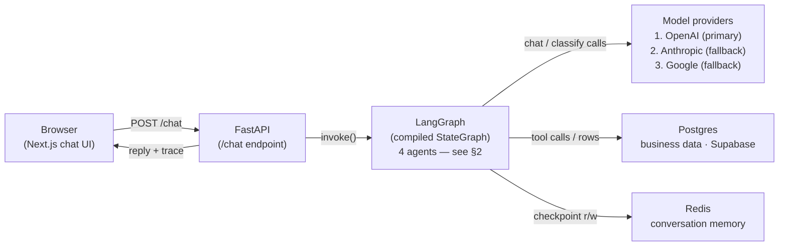
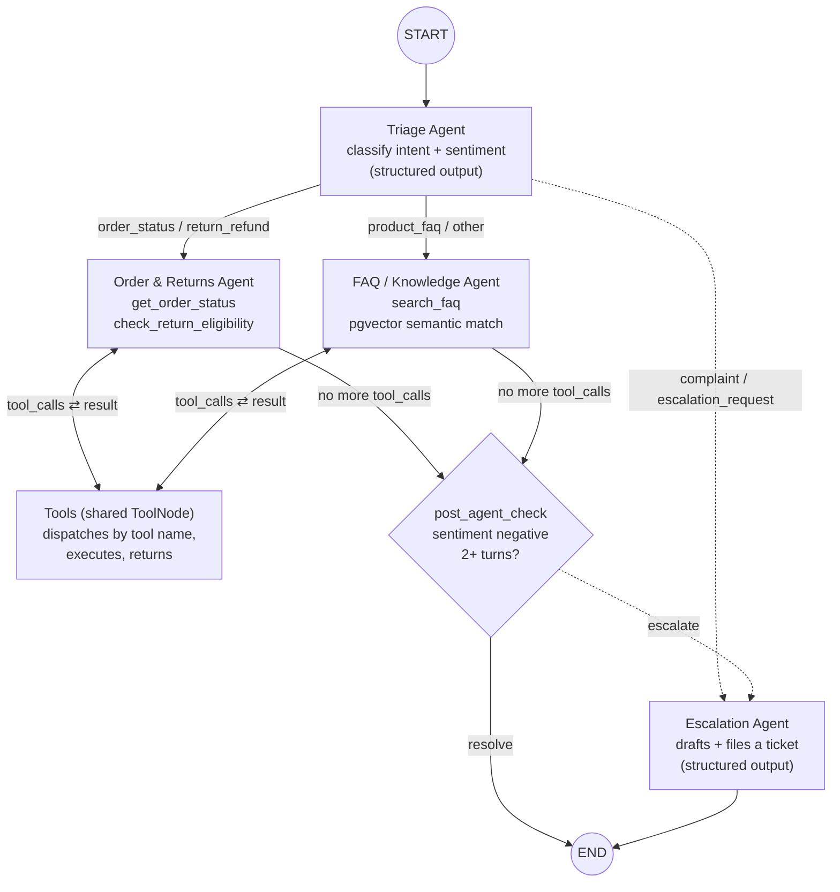
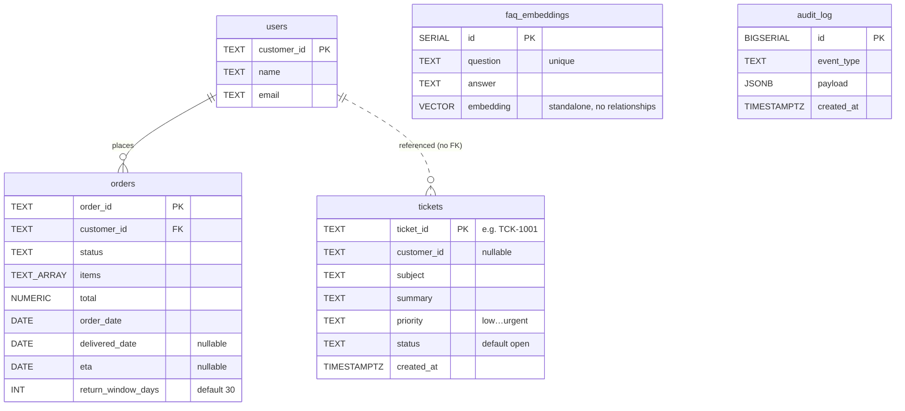

# UrbanCart Support POC — Technical Walkthrough

Three views of the same system: the request lifecycle end to end, the
LangGraph agent workflow that does the actual reasoning, and the Postgres
schema it all reads and writes.

## 1. Request lifecycle

Every chat message makes one round trip through four components. LangGraph
is the one doing the thinking — it expands into the full agent workflow in
section 2.

One HTTP round trip per message. The browser never talks to LangGraph,
Postgres, or Redis directly — FastAPI is the only entry point, and
everything downstream of `graph.invoke()` happens server-side, keyed by
`session_id`.

## 2. Inside LangGraph — the agent workflow

Four agents, not one prompt. A Triage agent classifies every message and
routes it; two specialists loop with tools until they have an answer; a
deterministic check — not another LLM call — decides whether a human needs
to get involved.

Matches `backend/app/graph.py` exactly, including the parts a summary would
normally drop: the shared `ToolNode` dispatches by tool name regardless of
which agent called it, and `post_agent_check` is plain Python reading
conversation state — not an LLM call — so the escalation safety net can't be
talked out of firing by a persuasive reply.

## 3. Data model

Five tables backing the workflow above, all living inside their own
**`urbancart`** Postgres schema — not `public` — specifically so this can
share a database with an existing application without touching it.

The only enforced relationship is `orders.customer_id → users.customer_id`;
the link from tickets to a customer is intentionally logical-only, since a
ticket can be filed before a customer is identified. `faq_embeddings` and
`audit_log` are standalone by design. A separate, pre-existing `public`
schema in the same database (18 tables, unrelated project) is untouched by
any of this.

| Table | Purpose |
|---|---|
| **users** | The customer directory. Every order and, loosely, every ticket traces back to a row here. |
| **orders** | System of record for order status, items, and delivery dates — what the Order & Returns agent reads and reasons over. |
| **tickets** | Human-escalation records the Escalation agent files when it can't resolve something on its own. |
| **faq_embeddings** | The knowledge base — each FAQ's text plus its vector embedding, searched by meaning (pgvector) instead of keyword. |
| **audit_log** | Append-only trail of every lookup, search, and ticket creation the agents perform — one row per action, timestamped. |

> **Verified, not assumed.** This schema was created against a live Supabase
> project that already had 18 tables from an unrelated, in-progress
> application in its `public` schema. After creating and seeding all five
> tables above, the existing 18 were checked again — still exactly 18,
> untouched. Same guarantee holds for any Postgres instance this runs
> against, including a fresh one.

---

- Agent workflow: `backend/app/graph.py`
- Provider chain: `backend/app/llm_providers.py`
- Schema DDL: `backend/app/store/postgres.py`
